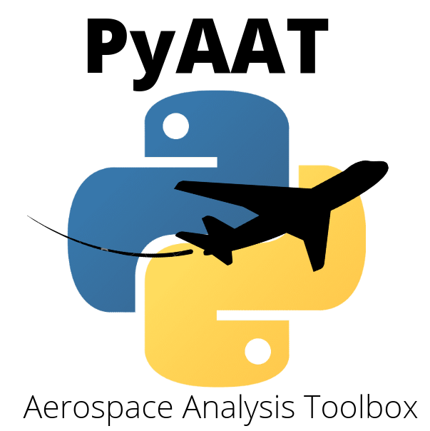

# PyAAT - Python Aerospace Analysis Toolbox

<h1 align="left"></h1>

| Name:         |Python Aerospace Analysis Toolbox- PyAAT     |
|---------------|-----------|
| Author:       |Kenedy Matiasso Portella|
| Website:      |https://github.com/KenedyMatiasso/PyAAT|
| Version:      |0.0.dev10|

## About PyAAT

Python Aerospace Analysis Toolbox is a python package aimed to support aerospace engineers along the design process. It includes a series of tools and models for modeling, analysis and simulation of aeronautic and space systems.

## What it provides

### Atmosphere

* International Standard Atmosphere - ISA (AIRBUS, 2002)
* Committee on Extension to the Standard Atmosphere - COESA (NASA, 1976)
* Simplified Model (COOK, 2007)

### Gravity

* Vertical Constant (Tewari, 2007)
* Newton Gravity (Tewari, 2007)
* High order gravity model (Tewari, 2007)

### Wind

* Steady vertical/horizontal wind (STEVENS, 2016)
* Wind gust FAR 25.341-1 (U.S DEPARTMENT OF TRANSPORTATION, 2014)

### Aerodynamics

* Based on stability derivatives (Sign convension according NACA DATa COmpendium- DATCOM)

### Propulsion

* Turbo-propeller (COOK, 2007)
* Turbo-fan (COOK, 2007)
* Turbo-jet (COOK, 2007)
* Electic propellers

### Body dynamics (rigid body only)

* 6 Degrees of fredom

## Instalation

The most recent stable version of PyAAT can be installed directly from pip repository using comand:

$ ``pip install pyaat``

If you want to install the most recent functional version (no guarantee of stability), you can install directly from our github repository using:

$  ``pip install git+https://github.com/KenedyMatiasso/PyAAT``
